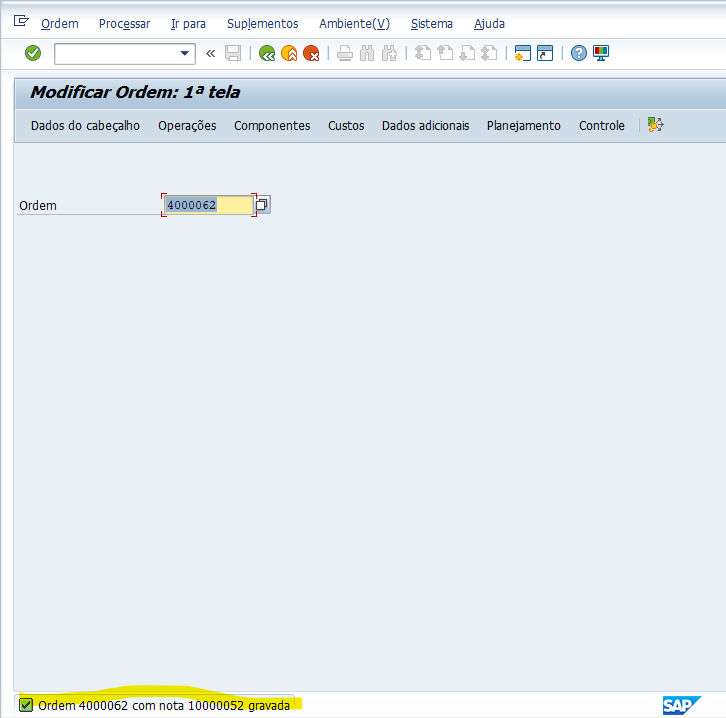

SAP PM: Controle de Permissão para Anular ENCE

Este projeto provê uma solução customizada para o módulo de SAP PM (Plant Maintenance), restringindo a anulação do Encerramento Comercial (ENCE) de ordens de manutenção apenas a usuários autorizados via tabela Z.
📋 Descrição do Cenário

Por padrão, a transação IW32 permite que usuários com acesso de modificação anulem o encerramento comercial das ordens. Esta implementação adiciona uma camada de governança, validando se o usuário logado possui permissão em uma tabela mestre customizada antes de permitir a gravação da anulação.
Componentes Técnicos

    Transação de Manutenção: ZF1GPM019.

    Tabela de Permissões: ZF1VPM_USR_ENCE.

    BAdI: WORKORDER_UPDATE.

    Método: BEFORE_UPDATE.

🚀 Funcionalidades

    Validação em Tempo Real: A verificação ocorre no momento em que o usuário tenta salvar a ordem na IW32.

    Gestão Descentralizada: Através da transação ZF1GPM019, gestores podem incluir ou remover usuários da lista de permissões sem necessidade de transporte de roles de segurança (PFCG).

    Mensagem Informativa: Caso um usuário não autorizado tente realizar a operação, o sistema exibe uma mensagem de erro clara indicando a falta de permissão.

💻 Implementação ABAP

A lógica principal identifica a mudança da fase da ordem (IPHAS) de '3' (Encerrada comercialmente) para estados anteriores, indicando uma tentativa de anulação.
ABAP

IF ls_header_old-iphas = '3' AND ls_header-iphas <> '3'.
  SELECT SINGLE 'X'
    FROM zzf1vpm_usr_ence
    INTO @DATA(lv_exists)
    WHERE bname = @sy-uname.

  IF sy-subrc <> 0.
    MESSAGE 'Usuário não autorizado para anular ENCE. Verifique a transação ZF1GPM019.' TYPE 'E'.
  ENDIF.
ENDIF.

🛠️ Como Configurar

    Criação da Tabela: Criar a tabela transparente ZZF1VPM_USR_ENCE com os campos MANDT, BNAME (Chave) e NAME_TEXT.

    Transação Z: Criar a transação ZF1GPM019 vinculada à manutenção da tabela acima.

    Implementação da BAdI: * Acesse a SE19.

        Crie uma implementação para a definição WORKORDER_UPDATE.

        Insira o código de validação no método BEFORE_UPDATE.

    Ativação: Ative a implementação da BAdI.
🧪 Fluxos de Teste (Sucesso vs. Sem Sucesso)

Este projeto foi validado através de testes funcionais para garantir que a trava de segurança atue apenas quando necessário.
🔴 Cenário 01: Sem Sucesso (Usuário Não Autorizado)

Neste cenário, o usuário logado não consta na tabela da transação ZF1GPM019.

    Ação: O usuário tenta anular o encerramento comercial de uma ordem com status ENCE.

    Processamento: A BAdI identifica a mudança de fase e verifica a ausência do usuário na tabela ZZF1VPM_USR_ENCE.

    Resultado: O SAP bloqueia a gravação e exibe uma mensagem de erro na barra de status.

🟢 Cenário 02: Sucesso (Usuário Autorizado)

Neste cenário, o usuário está cadastrado corretamente na tabela de controle.

    Configuração: O administrador adiciona o usuário na transação ZF1GPM019.

    Ação: O usuário autorizado realiza o mesmo procedimento de anulação na transação IW32.

    Resultado: O sistema valida a permissão e permite a gravação da ordem, confirmando a alteração com sucesso.
    
    
